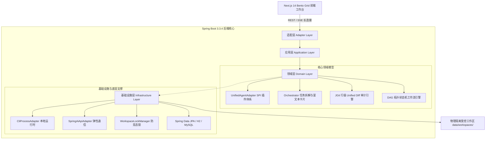

# AgentHub

<p align="center"><strong>企业级 IM 聊天式多 Agent 协同研发平台</strong></p>

<p align="center">
  <a href="https://github.com/RubiumOnly/AgentHub/actions/workflows/ci.yml"></a>
  <a href="https://www.oracle.com/java/"></a>
  <a href="https://spring.io/projects/spring-boot"></a>
  <a href="https://nextjs.org/"></a>
  <a href="https://www.typescriptlang.org/"></a>
  <a href="https://tailwindcss.com/"></a>
  <a href="https://www.eclipse.org/jgit/"></a>
  <a href="https://developer.mozilla.org/en-US/docs/Web/API/Server-sent_events"></a>
  <a href="https://www.docker.com/"></a>
  <a href="LICENSE"></a>
</p>

[快速开始](#-快速开始) · [核心能力](#-核心能力) · [功能状态矩阵](#-功能状态矩阵) · [系统架构与-DDD-分层](#-系统架构与-ddd-四层分层) · [技术文档](docs/ARCHITECTURE.md) · [API 参考](docs/API.md) · [安全说明](SECURITY.md) · [贡献指南](CONTRIBUTING.md) · [更新记录](CHANGELOG.md)

---

## 🌟 项目定位与核心愿景

**AgentHub** 是面向企业级复杂研发协同场景打造的下一代 **IM 聊天式多 Agent 协同研发平台**。系统聚焦在 AI 驱动的全流程开发闭环，融合了 **严谨的 Java 后端高并发工程架构** 与 **先进的多智能体协作理论**。

针对大模型单一 Agent 上下文易膨胀退化、多 Agent 协作缺乏工程闭环与物理竞态覆写的痛点，AgentHub 提供了：
- **类飞书/Slack 自然交互体验**：支持单聊、多会话并发管理与基于 `@Mention` 指令的群聊智能协同；
- **Orchestrator 任务拓扑拆解引擎**：长程需求智能分解为有向无环图（DAG）子任务，并通过富文本交互式卡片（Interactive Cards）进行审批与状态反馈；
- **统一智能体 SPI 适配器层**：兼容主流本地 CLI（Claude Code、Codex、OpenClaw）与云端大模型 API（DeepSeek V3 / Spring AI Native），实现非阻塞多通道协同；
- **基于 JGit 的真实代码 Diff 审计**：工作区受原生 Git 版本控制，精确比对文件树与基线版本，输出行级 Unified Diff；
- **Bento Grid 全栈控制台**：Next.js 14 打造的暗黑美学工作台，集成可视化 DAG 工作流画布、工作区文件树、实时 Web 预览沙箱与一键 Docker 部署。

---

## 📊 功能状态矩阵

| 功能模块 | 核心能力描述 | 当前实现状态 | 演进规划 |
| :--- | :--- | :---: | :--- |
| **IM 协同总线** | 会话生命周期、@Mention 指令路由、群聊广播 |  | 支持群组权限角色划分与敏感词拦截 |
| **流式打字机** | Server-Sent Events (SSE) 实时长连接通信 |  | 支持 WebSocket 双向流式断点续传 |
| **任务拓扑编排** | Orchestrator 需求多阶段拆解与交互式卡片 |  | 引入长程任务失败回溯与多分支动态条件决策 |
| **统一 SPI 架构** | 解耦 CLI 本地进程管道与云端 API 交互 |  | 扩充 Ollama、vLLM 本地私有化大模型接入点 |
| **DeepSeek 集成** | 官方 DeepSeek V3 对话与代码生成模型支持 |  | 支持 Function Calling 工具调用扩展 |
| **版本控制审计** | Eclipse JGit 原生行级 Unified Diff 与增删行指标 |  | 支持一键生成 Git Commit 与 PR 提交推送 |
| **防并发锁治理** | 工作区细粒度 ReentrantLock 互斥，杜绝脏写 |  | 扩展基于 Redis/Redisson 的分布式多节点锁 |
| **可视化 DAG 画布** | 基于 `@xyflow/react` 的拖拽式工作流节点编排 |  | 画布与后端 DAG 引擎双向实时执行状态高亮联动 |
| **工作区文件树** | 实时物理目录扫描与 Monaco 代码在线编辑预览 |  | 增加多标签页代码对比与语法高亮扩展 |
| **实时预览沙箱** | 动态 Web 页面 iframe 挂载渲染与资源预览 |  | 提供 WebAssembly 与隔离 Node.js 容器化执行沙箱 |
| **一键容器化部署** | 自动化生成生产级 Dockerfile 与部署配置清单 |  | 集成 Kubernetes Deployment 编排模板生成 |

---

## 🏗️ 系统架构与 DDD 四层分层

系统遵循经典的 **领域驱动设计 (DDD)** 四层架构，各层边界分明、职责单一：



### 目录工程结构

```
agenthub/
├── agenthub-backend/                  # Spring Boot 3.3.4 (Java 17 LTS)
│   ├── src/main/java/com/agenthub/
│   │   ├── adapter/                  # 接口适配层 (RESTful API, Web Controller, Result<T>)
│   │   ├── application/              # 应用服务层 (IMCollaborationService, 业务流程编排)
│   │   ├── domain/                   # 核心领域层 (Agent SPI, 协同卡片, JGit Diff, DAG 引擎)
│   │   └── infrastructure/           # 基础设施层 (CLI 管道, Spring AI/DeepSeek, 并发锁, JPA)
│   └── src/test/java/com/agenthub/   # 13/13 绿灯单元与防御性集成测试矩阵
│
├── agenthub-frontend/                 # Next.js 14 + Tailwind CSS 前端控制台
│   ├── src/app/                      # Bento Grid 仪表盘大厅与 SSE 实时事件连接
│   └── src/components/               # WorkflowCanvas (DAG 画布), WorkspaceExplorer (文件树)
│
├── data/workspaces/                  # 受 Git 控制的多 Agent 物理协作工作区
├── docs/                             # 系统技术文档
│   ├── ARCHITECTURE.md               # 核心架构设计说明书
│   └── API.md                        # RESTful API 与 SSE 事件流契约
├── .github/workflows/ci.yml          # GitHub Actions 自动化 CI 流水线
├── docker-compose.yml                # 本地全套服务容器化编排配置
├── ARCHITECTURE_INDEX.md             # AOCI 规范高密度架构代码地图
├── SECURITY.md                       # 安全策略与凭证管理规范
├── CONTRIBUTING.md                   # 开发者贡献与代码提交规范
└── CHANGELOG.md                      # 中文更新日志与版本归档
```

---

## 🤖 统一智能体 SPI 架构与平台生态

系统通过统一接口规范解耦多源智能体，支持多样化的运行时环境：

| 智能体标识 | 运行时分类 | 职责定位 | 通信机制 |
| :--- | :--- | :--- | :--- |
| **`Orchestrator`** | 协调中枢 | 复杂长程任务理解、阶段拓扑分解、协同卡片派发 | 内部核心编排器 |
| **`BackendArchitect`**| 云端 LLM / CLI | Spring Boot 3、DDD 架构设计、企业级接口编写 | DeepSeek V3 / API / CLI |
| **`FrontendEngineer`**| 云端 LLM / CLI | Next.js 14、React 响应式组件开发、美学交互实现 | DeepSeek V3 / API / CLI |
| **`QAAuditor`** | 本地审计引擎 | JGit 代码变更审查、测试边界覆盖度校验 | Eclipse JGit 原生内核 |
| **`Claude Code`** | 本地 CLI 运行时 | Anthropic 官方 CLI 智能体环境 | 异步子进程管道 + 正则脱敏 |
| **`Codex CLI`** | 本地 CLI 运行时 | OpenAI Codex 终端代码协同 | 异步子进程管道 + 看门狗超时 |
| **`OpenClaw`** | 本地 CLI 运行时 | 开源本地代码执行终端智能体 | 异步子进程管道 + 优雅降级 |

---

## ⚡ 真实协同运行流程 (Live Run)

1. **发起协同**：在聊天窗口发送 `@Orchestrator 请帮我实现一个用户中心`；
2. **任务拓扑拆解**：`Orchestrator` 拆解为三阶段有向子任务，并生成飞书级富文本卡片；
3. **并发代码编写**：`BackendArchitect` 与 `FrontendEngineer` 协同编写代码，并通过打字机效果流式返回；
4. **工作区自动落盘**：生成的源码安全写入物理隔离的 `data/workspaces/default/`；
5. **JGit 行级 Diff 捕获**：系统自动调用 JGit 核心比对基线版本，实时展示精确到行的代码差异补丁；
6. **人工审批与一键部署**：用户可在右侧面板审查代码变更、浏览工作区文件树或在沙箱中进行实时预览与容器构建。

---

## 🚀 快速开始

### 1. 前置依赖
- **JDK 17 LTS** 或更高版本
- **Maven 3.8+**
- **Node.js 18+ & npm**
- **Git**

### 2. 后端服务启动 (Spring Boot 8080)

```bash
cd agenthub-backend

# 1. 运行全部单元测试矩阵（确保 100% 绿灯）
mvn test

# 2. 启动 Spring Boot 后端
mvn spring-boot:run
```
> 后端服务默认监听 `http://localhost:8080`，内置 H2 内存数据库与 `/h2-console`。

### 3. 前端工作台启动 (Next.js 3000)

```bash
cd agenthub-frontend

# 1. 安装前端依赖
npm install

# 2. 启动开发服务器
npm run dev
```
> 在浏览器打开 `http://localhost:3000` 即可进入 Bento Grid 协作工作台。

### 4. 环境变量与私有配置

项目严格遵循凭证安全规范，**绝不在 Git 仓库中包含任何明文密钥**。

如需使用真实云端 DeepSeek 模型能力：
- **方式一（推荐，私有文件隔离）**：复制根目录的 [`.env.example`](.env.example) 或在 `agenthub-backend/src/main/resources/` 目录下创建 `application-local.yml`（已受 `.gitignore` 保护，不会入库）：
  ```yaml
  agenthub:
    llm:
      deepseek:
        api-key: "你的_DEEPSEEK_API_KEY"
  ```
- **方式二（系统环境变量）**：
  ```bash
  export DEEPSEEK_API_KEY="你的_DEEPSEEK_API_KEY"
  ```
> 若未配置 API Key，系统会自动激活内置的高仿真离线智能模拟器，保障核心协同链路正常演示与测试。

---

## 🛡️ 安全与凭证管理规范

- **零敏感信息入库**：代码库全局配置了严苛的 [`.gitignore`](.gitignore)，禁止任何 `.env*` 及 `*application-local*.yml` 密钥文件提交；
- **进程看门狗机制**：本地 CLI 进程统一配置最长执行超时与强制回收逻辑，防止僵尸进程耗尽系统资源；
- **工作区目录遍历防御**：所有对文件读写操作均施加路径边界校验，杜绝越权访问系统关键目录。
- 详细安全指引请参阅 [SECURITY.md](SECURITY.md)。

---

## 🧪 测试度量与工程质量

后端测试套件遵循五维边界防御设计矩阵，执行 `mvn test` 验证结果如下：

```
[INFO] -------------------------------------------------------
[INFO]  T E S T S
[INFO] -------------------------------------------------------
[INFO] Running com.agenthub.AgentAdapterTest (4 tests) - PASSED
[INFO] Running com.agenthub.IMCollaborationTest (3 tests) - PASSED
[INFO] Running com.agenthub.SandboxAndDeployTest (2 tests) - PASSED
[INFO] Running com.agenthub.SystemHealthTest (1 test) - PASSED
[INFO] Running com.agenthub.WorkflowAndJGitTest (3 tests) - PASSED
[INFO] 
[INFO] Results:
[INFO] Tests run: 13, Failures: 0, Errors: 0, Skipped: 0
[INFO] BUILD SUCCESS
```

- **测试绿灯率**：**100%（13/13 通过）**
- **前端构建**：`npm run build` 静态类型检查 0 错误通过。

---

## 🤝 贡献与许可证

欢迎通过 GitHub Issues 提出改进建议或 Bug 反馈；提交代码前请阅读 [CONTRIBUTING.md](CONTRIBUTING.md)。

本项目采用 [MIT License](LICENSE) 开源许可证。
